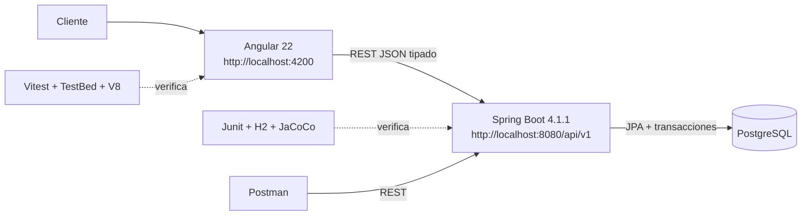
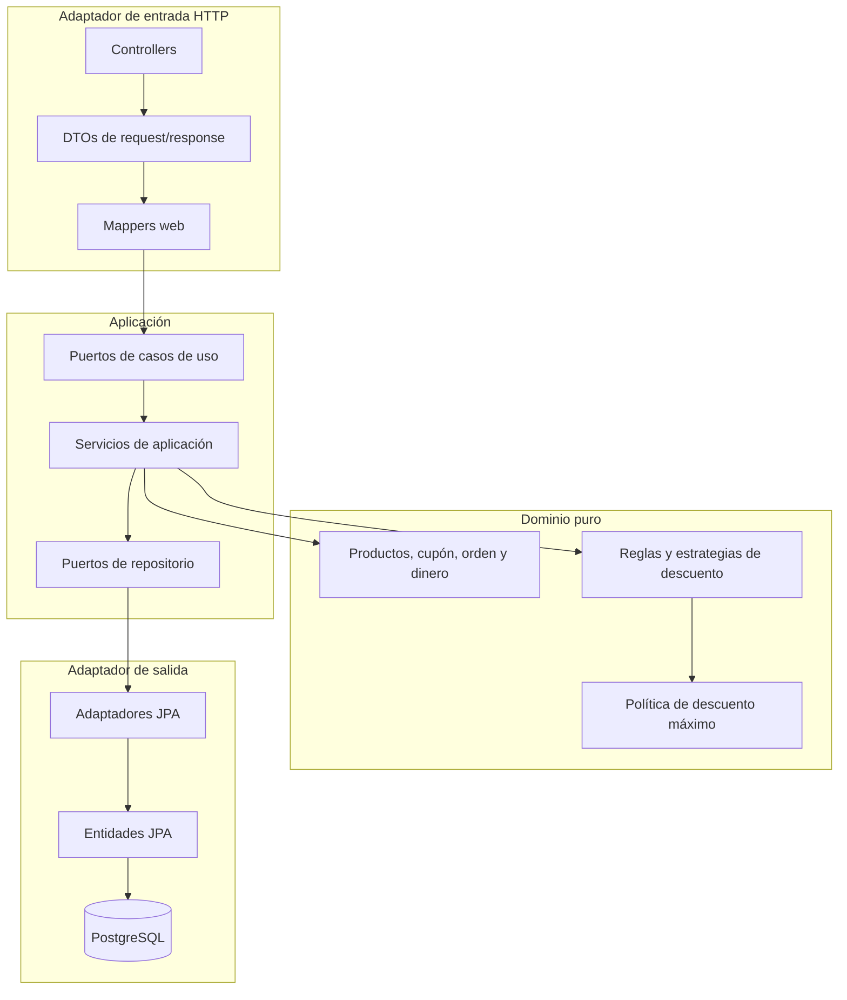
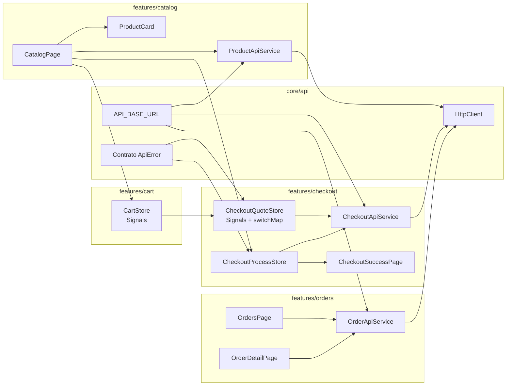
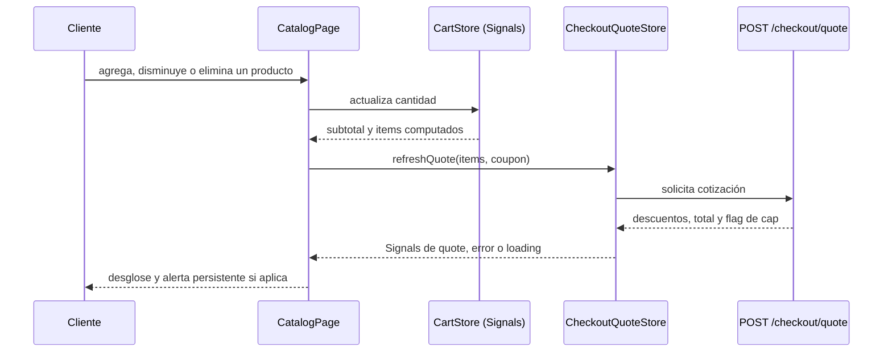
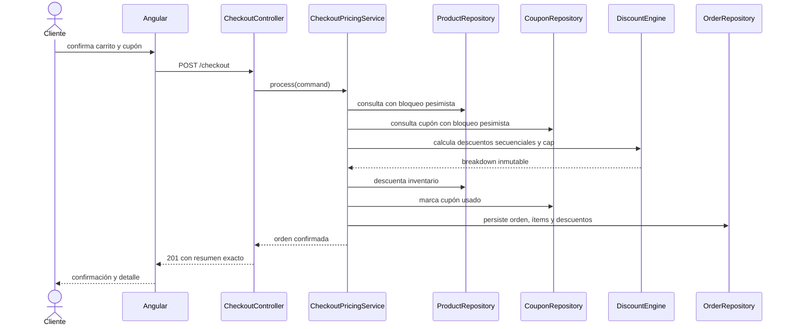
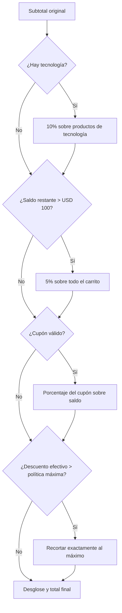
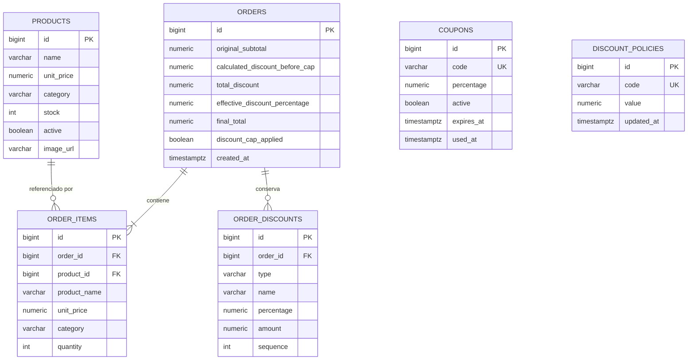
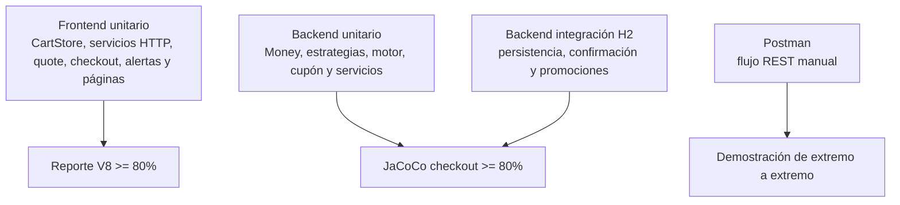

# 🧭 Arquitectura

## 🎯 Propósito y criterio de diseño

DaviShop resuelve un MVP de checkout donde el riesgo principal no es la cantidad de pantallas, sino conservar la consistencia entre descuentos secuenciales, inventario, cupón y orden persistida. Por ello se eligió un monorepo con dos aplicaciones autónomas: Angular para una interfaz reactiva y Spring Boot para un núcleo de negocio transaccional.

La solución prioriza cuatro propiedades:

1. **Corrección del cálculo:** las promociones se aplican en secuencia y el límite se evalúa al final.
2. **Consistencia al confirmar:** la orden no confía en una cotización anterior; vuelve a consultar y bloquea los recursos necesarios.
3. **Claridad de responsabilidades:** el backend protege el dominio y el frontend organiza el flujo por capacidades visibles del usuario.
4. **Complejidad proporcional:** no se introducen microservicios, NgRx, Docker, Flyway, Testcontainers ni capas vacías que no aporten al alcance.

## 🗺️ Vista general



## 🗂️ Monorepo

```text
.
├── apps/
│   ├── backend/                    # API Spring Boot
│   │   ├── database/                # schema, seed y reinicio de demo
│   │   ├── postman/                 # colección de pruebas HTTP
│   │   └── src/main/java/com/ecommerce/core/
│   │       ├── catalog/
│   │       ├── promotion/
│   │       ├── checkout/
│   │       ├── order/
│   │       └── shared/
│   └── frontend/                   # Aplicación Angular
│       └── src/app/
│           ├── core/api/
│           ├── features/catalog/
│           ├── features/cart/
│           ├── features/checkout/
│           └── features/orders/
├── docs/                            # arquitectura y gobernanza de IA
└── .ai/                             # skill y agente de revisión
```

`packages/` no se creó: el contrato compartido habría agregado una dependencia de build entre Java y TypeScript sin necesidad real. Cada borde HTTP posee sus DTOs tipados y pruebas de contrato en su propia aplicación.

## ☕ Backend: monolito modular con arquitectura hexagonal pragmática

Cada módulo de negocio contiene dominio, aplicación e infraestructura. Se mantienen los puertos donde el desacoplamiento sí cambia el costo de evolución: repositorios, casos de uso y adaptadores web/persistencia.



### 🧩 Módulos de backend

| Módulo | Responsabilidad |
| --- | --- |
| `catalog` | Consulta de productos activos e inventario. |
| `promotion` | Consulta de cupones y política máxima configurable. |
| `checkout` | Cotización, confirmación, motor de descuentos y coordinación transaccional. |
| `order` | Agregado persistido, snapshots, listado y detalle. |
| `shared` | Errores de negocio y mapeo HTTP común. |

### 🧠 Patrones aplicados explícitamente

| Patrón | Aplicación | Beneficio |
| --- | --- | --- |
| **Strategy** | `CategoryDiscountStrategy`, `VolumeDiscountStrategy` y `CouponDiscountStrategy`. | Añadir una regla no obliga a condicionar un servicio central ni cambiar reglas existentes. |
| **Pipeline** | `DiscountEngine` ejecuta las estrategias por secuencia. | Conserva el cálculo multiplicativo sobre el saldo y deja evidencia ordenada de cada descuento. |
| **Policy** | `MaximumDiscountPolicy` se aplica después del pipeline. | Evita tratar el tope global como una promoción y mezcla de responsabilidades. |
| **Ports and Adapters** | Casos de uso y repositorios dependen de puertos; HTTP/JPA los adaptan. | El dominio no depende de Spring, JPA ni DTOs web. |

## 🅰️ Frontend: arquitectura modular por feature

Angular se organiza por funcionalidad de producto y no replica las capas del backend. Es una elección deliberada: la aplicación tiene pocas pantallas y una lógica local acotada; una arquitectura limpia completa o NgRx agregarían archivos y ceremonias sin aumentar la corrección.



### ⚡ Estado y reactividad



- **Signals** almacenan el estado local y síncrono: carrito, estado de cotización, confirmación y listas de las páginas.
- **RxJS** se usa solo en bordes asíncronos. `switchMap` cancela el resultado obsoleto cuando el usuario modifica el carrito antes de que responda la cotización.
- **Servicios API** encapsulan `HttpClient` y contratos; las páginas no construyen URLs ni interpretan respuestas HTTP directamente.
- **TypeScript estricto y plantillas estrictas** están habilitados mediante `strict: true` y `strictTemplates: true`; no se usan `any` genéricos.

## 🔄 Flujo de checkout consistente



`POST /checkout/quote` reutiliza el mismo cálculo, pero no bloquea ni persiste. `POST /checkout` vuelve a consultar dentro de una transacción y no confía en la cotización mostrada previamente.

## 💸 Motor de descuentos



Las estrategias trabajan sobre el saldo dejado por la anterior; los porcentajes no se suman. La política máxima no es una estrategia: es una restricción transversal aplicada una sola vez al final.

## 🗃️ Modelo de datos



`order_items` conserva snapshots de nombre, precio y categoría. Así una orden histórica no cambia si el catálogo evoluciona. El cupón no se duplica como `coupon_code` en `orders`: el registro en `order_discounts` constituye la evidencia aplicada y evita inconsistencias. `discount_policies` y `coupons` se resuelven al procesar una compra, pero no se convierten en claves históricas de la orden.

## 🔌 API y contratos

| Método | Ruta | Consumidor | Responsabilidad |
| --- | --- | --- | --- |
| `GET` | `/api/v1/products` | Catálogo Angular | Productos activos con stock. |
| `POST` | `/api/v1/checkout/quote` | `CheckoutQuoteStore` | Cotización pura para reaccionar al carrito. |
| `POST` | `/api/v1/checkout` | `CheckoutProcessStore` | Confirmación transaccional y respuesta `201`. |
| `GET` | `/api/v1/orders` | `OrdersPageComponent` | Historial de órdenes. |
| `GET` | `/api/v1/orders/{id}` | `OrderDetailPageComponent` | Ítems y descuentos persistidos. |

Los contratos del frontend son interfaces inmutables (`readonly`). Los errores de negocio conservan `status`, `code`, `message`, `path` y validaciones para que la UI muestre el mensaje del backend sin acoplarse a excepciones Java.

## 🧪 Pruebas y calidad



- Frontend: Vitest/TestBed/V8 valida carrito, stock, solicitud de quote, errores, cap, confirmación, listado y detalle.
- Backend: JUnit y H2 aislado cubren secuencia, umbrales, cupones, stock, cap y confirmación persistida.
- JaCoCo se enfoca en `checkout` y excluye infraestructura; se mide la lógica donde se toman decisiones de negocio, no DTOs triviales.
- La aplicación se verificó mediante `npm run test:coverage`, `npm run build` y `.\mvnw.cmd verify`.

## ⚖️ Decisiones y trade-offs

| Decisión | Beneficio | Trade-off aceptado |
| --- | --- | --- |
| Spring Boot modular y hexagonal pragmática | Dominio protegido y pruebas aisladas. | Más archivos que un CRUD directo. |
| Angular por features | Navegación y capacidades fáciles de ubicar. | No existe una capa compartida de dominio frontend, porque hoy no es necesaria. |
| Signals locales + RxJS en HTTP | Estado simple y cancelación de quotes obsoletos. | No se incorpora time-travel ni devtools de un store global. |
| PostgreSQL local + scripts SQL | Inicio reproducible y fácil de evaluar. | Migraciones versionadas avanzadas se dejan fuera del MVP. |
| H2 solo en pruebas | Pruebas rápidas sin alterar la demo PostgreSQL. | No sustituye un entorno de integración con PostgreSQL real. |
| Sin Docker, Flyway, NgRx, Testcontainers ni microservicios | Menor costo operativo y foco en reglas críticas. | Esas herramientas serían candidatas si el sistema creciera. |

## 🔭 Riesgos conocidos y evolución

- Las reglas semilla actuales no llegan por sí solas al cap de 35%; se prueba el comportamiento del motor con una política que lo activa y se prueba la alerta de UI con una respuesta tipada que marca `discountCapApplied`.
- Si aparecen más promociones, se agregan nuevas estrategias y se mantienen sus secuencias sin modificar las existentes.
- Si se requieren autenticación, pagos externos o alta concurrencia distribuida, se incorporarían identidad, idempotencia de pagos y observabilidad antes de dividir el monolito.
